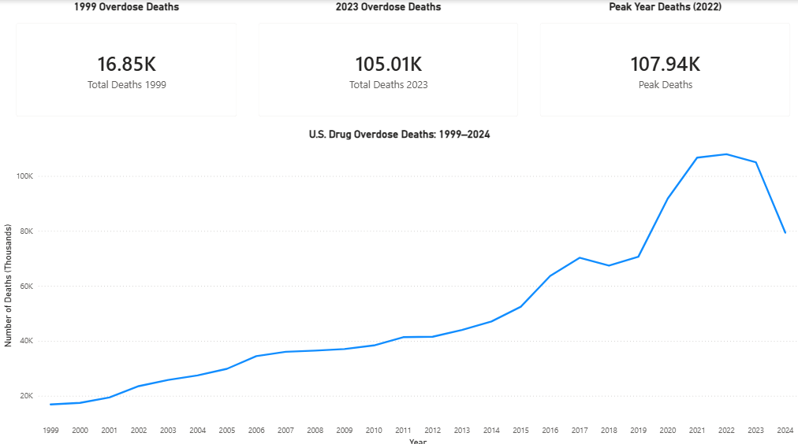
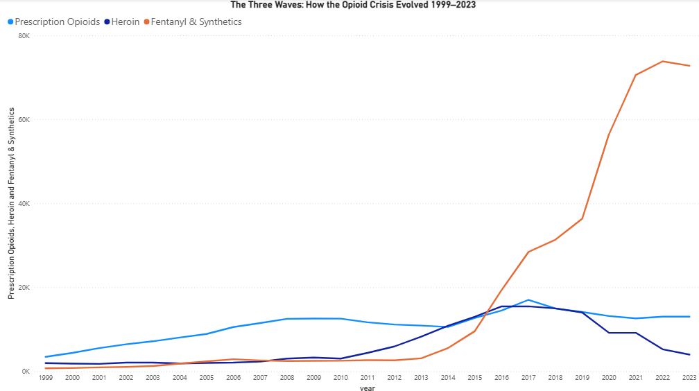
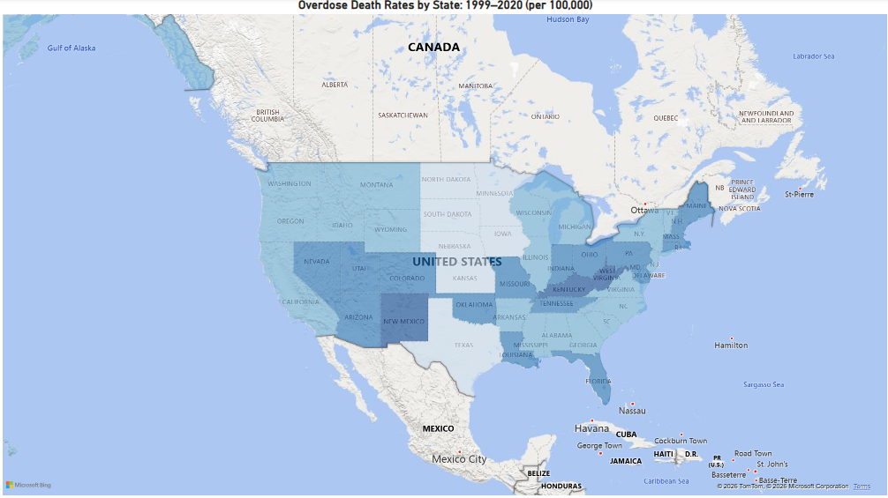
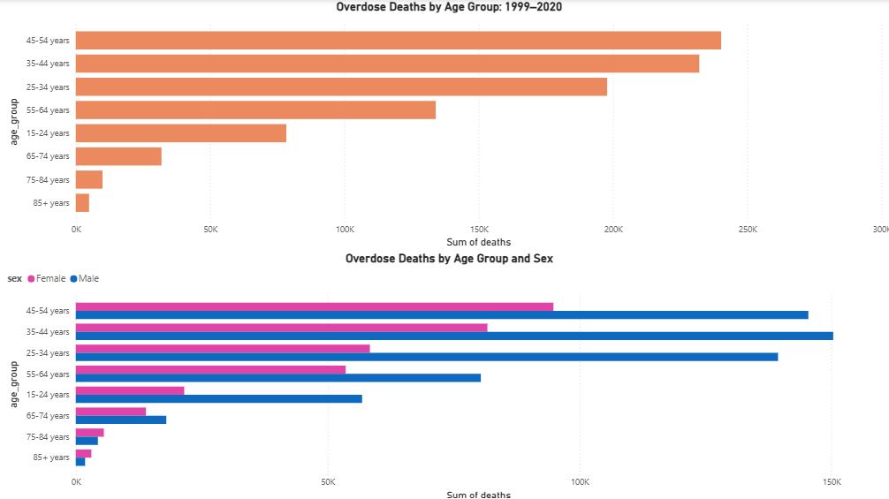
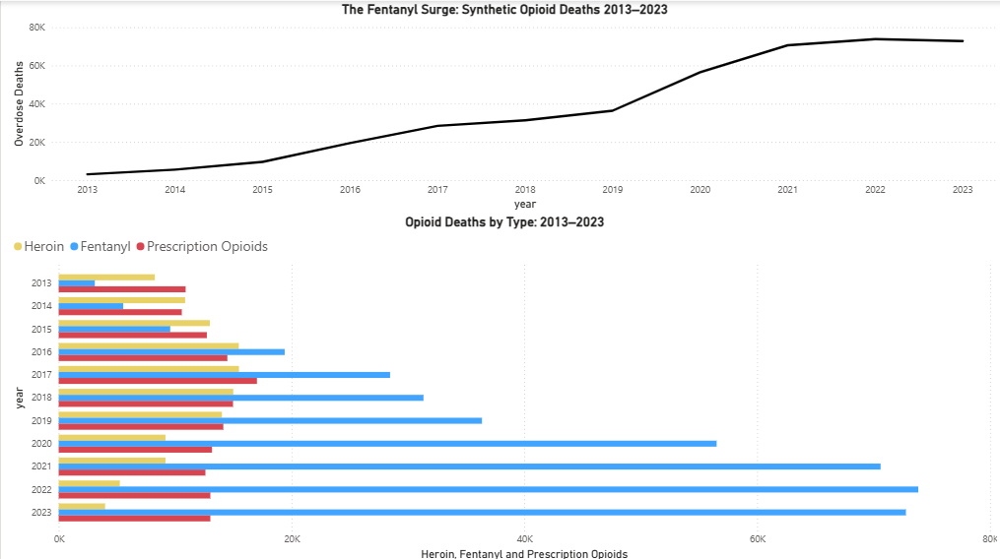

# 💊 The Opioid Crisis: A 25-Year Analysis
### Public Health Analytics Series — Project 2 of 3 | Tools: Python, SQLite, Power BI

A data-driven investigation into the deadliest drug crisis in American history. This project analyzes CDC mortality data from 1999 to 2024 to trace the opioid epidemic across three distinct waves — prescription painkillers, heroin, and synthetic opioids — while examining the geographic, demographic, and economic dimensions of who has been hit hardest.

---

## 📁 Project Structure

```
opioid-crisis-analysis/
│
├── csv/                              # Source data files
│   ├── opioid_national_by_year.tsv
│   ├── opioid_national_2021_2024.tsv
│   ├── opioid_by_state_totals.tsv
│   ├── opioid_by_state_year.tsv
│   ├── opioid_by_age_sex.tsv
│   └── opioid_by_drug_type.csv
│
├── screenshots/                      # Dashboard page screenshots
│   ├── opioid_overview.png
│   ├── opioid_three_waves.png
│   ├── opioid_state_map.png
│   ├── opioid_demographics.png
│   └── opioid_fentanyl_surge.png
│
├── opioid_etl.py                     # Python ETL script
├── opioid_crisis.db                  # SQLite database
└── Opioid Crisis.pbix                # Power BI dashboard
```

---

## 📊 Data Sources

All data sourced from CDC National Vital Statistics System (NVSS) via CDC WONDER — free public access, no application required.

| Source | Coverage | What It Provides |
|--------|----------|-----------------|
| CDC WONDER (1999–2020 Bridged-Race) | 1999–2020 | National and state overdose deaths, demographics |
| CDC WONDER (2018–2024 Provisional) | 2021–2024 | Recent national overdose deaths |
| CDC NCHS Data Briefs No. 356, 428, 457, 491 | 1999–2023 | Drug-type breakdown (prescription, heroin, fentanyl) |

---

## 🔧 Tools & Workflow

**Python** → TSV/CSV loading, cleaning, combining annual files, SQLite export

**SQLite** → structured storage and SQL analysis queries

**Power BI** → 5-page interactive dashboard with map visualization

---

## 🗄️ Database Schema

Five tables loaded into `opioid_crisis.db`:

| Table | Rows | Description |
|-------|------|-------------|
| `national_trend` | 26 | Year-by-year overdose deaths and crude rates 1999–2024 |
| `state_totals` | 51 | Cumulative overdose deaths and rates for all 50 states + DC |
| `state_by_year` | 1,122 | State-level deaths by year 1999–2020 |
| `demographics` | 24 | Deaths and crude rates by age group and sex |
| `drug_type` | 25 | Deaths by drug type (prescription, heroin, fentanyl) 1999–2023 |

---

## 🔍 SQL Analysis

### National Trend 1999–2024
```sql
SELECT year, deaths, crude_rate
FROM national_trend
ORDER BY year;
```

### The Three Waves
```sql
SELECT year, prescription_opioids, heroin, synthetic_opioids_fentanyl, any_opioid
FROM drug_type
ORDER BY year;
```

### Hardest Hit States
```sql
SELECT state, deaths, crude_rate
FROM state_totals
ORDER BY crude_rate DESC
LIMIT 10;
```

### Demographics
```sql
SELECT age_group, sex, deaths, crude_rate
FROM demographics
WHERE age_group NOT IN ('< 1 year', '1-4 years', '5-14 years', 'Not Stated')
ORDER BY age_group, sex;
```

---

## 📈 Dashboard — Page by Page

### Page 1 — Overview


Drug overdose deaths climbed from **16,849 in 1999 to a peak of 107,941 in 2022** — a 541% increase over 23 years. The trend line shows two distinct acceleration points: around 2015 when fentanyl began entering the supply, and 2020 when COVID-era isolation dramatically worsened the crisis.

🔎 **Key Finding:** The 2024 figure of 79,384 represents the first meaningful decline in overdose deaths in over two decades — but remains nearly 5 times the 1999 baseline, and may be partially explained by incomplete death certificate reporting for the most recent year.

---

### Page 2 — The Three Waves


The opioid crisis unfolded in three distinct waves, each driven by a different drug:

- **Wave 1 (1999–2010):** Prescription opioids climbed steadily as pharmaceutical companies aggressively marketed painkillers and prescribing practices loosened
- **Wave 2 (2010–2016):** As prescriptions were cracked down, users shifted to heroin — cheaper and more accessible — which surged to a peak of 15,469 deaths in 2016
- **Wave 3 (2013–present):** Synthetic opioids, primarily illicitly manufactured fentanyl, entered the supply and overwhelmed both previous waves — reaching 73,838 deaths in 2022

🔎 **Key Finding:** Fentanyl deaths in 2022 exceeded the entire opioid death toll from any single year before 2015. Meanwhile heroin deaths collapsed from 15,469 in 2016 to just 3,984 in 2023 — not because users recovered, but because fentanyl replaced it in the drug supply.

---

### Page 3 — State Map


Overdose death rates vary dramatically by state, with a clear geographic pattern centered on Appalachia, the Mid-Atlantic, and the Southwest.

🔎 **Key Finding:** West Virginia leads all states with a crude rate of **28.3 per 100,000** — more than double the national average. The top 10 hardest hit states include West Virginia (28.3), New Mexico (22.5), DC (21.4), Kentucky (21.4), Nevada (19.8), Pennsylvania (19.8), Maryland (19.7), Delaware (19.4), Ohio (19.4), and Rhode Island (19.0). The Appalachian corridor's concentration reflects decades of economic decline, physical labor injuries, and aggressive pharmaceutical targeting of the region.

---

### Page 4 — Demographics


The opioid crisis has hit working-age adults hardest, with men dying at more than twice the rate of women across every age group.

🔎 **Key Finding:** Adults aged **35–44 and 45–54** account for the highest total death counts. Men aged 25–34 face a crude rate of **30.0 per 100,000** — the highest of any demographic group — reflecting the intersection of physical labor, economic stress, and substance use patterns in that population.

---

### Page 5 — The Fentanyl Surge


Zooming in on 2013–2023, the fentanyl takeover is unmistakable. From barely registering in 2013 at 3,105 deaths, synthetic opioids exploded to 73,838 by 2022 — a 2,278% increase in under a decade.

🔎 **Key Finding:** By 2020 fentanyl accounted for more than **80% of all opioid overdose deaths**. Its dominance is driven by its potency (50–100x stronger than morphine), its profitability for traffickers, and its contamination of the broader drug supply — meaning users of other substances are now dying from fentanyl exposure without seeking it out.

---

## 💡 Key Takeaways

- U.S. drug overdose deaths increased **541%** from 1999 to 2022
- Three distinct waves drove the crisis — each more lethal than the last
- **West Virginia's death rate (28.3)** is more than double the national average — Appalachia has been disproportionately devastated
- **Men aged 25–44** are the hardest hit demographic group
- Fentanyl now accounts for **80%+ of opioid deaths** and has effectively replaced heroin in the illicit drug supply
- 2023–2024 data shows the **first decline** in overdose deaths in over two decades — driven by expanded naloxone access and harm reduction programs

---

## 🗂️ Portfolio Navigation — Public Health Analytics Series

| # | Project | Tools |
|---|---------|-------|
| 1 | [ADHD in America: A 25-Year Analysis](https://github.com/brycegardner90/adhd-in-america) | Python, SQLite, Power BI |
| **2** | **The Opioid Crisis: A 25-Year Analysis** | **Python, SQLite, Power BI** |
| 3 | [Mental Health in America: Trends & Treatment Gaps](https://github.com/brycegardner90/mental-health-trends) | Python, SQLite, Power BI |
